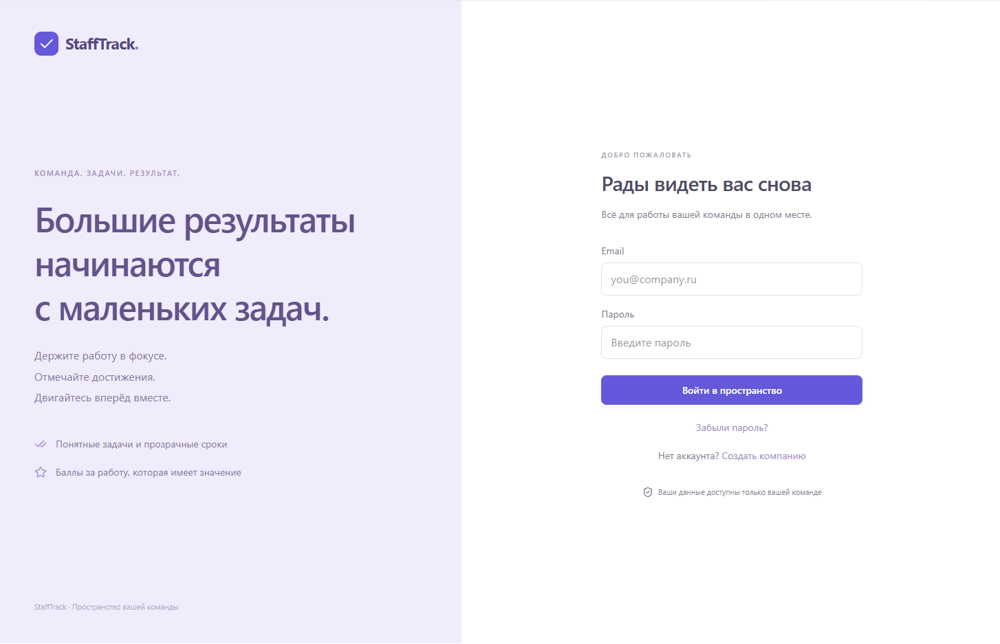
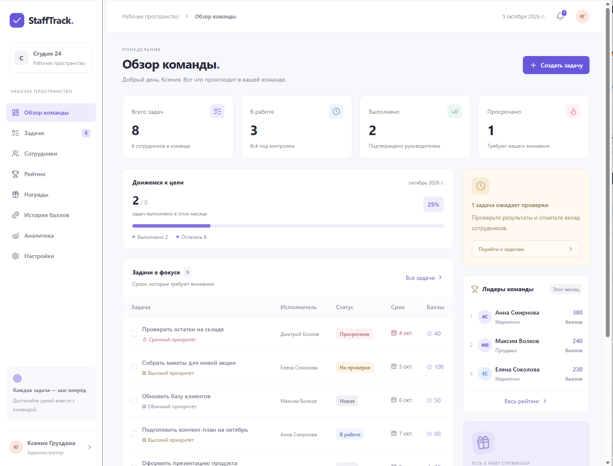
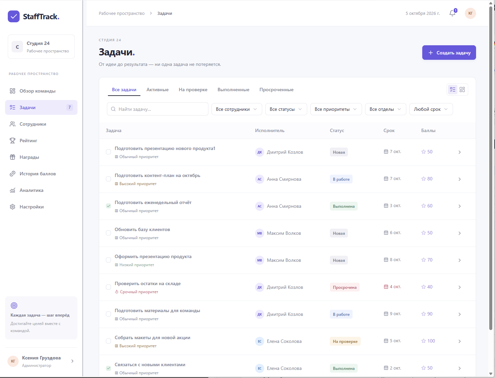
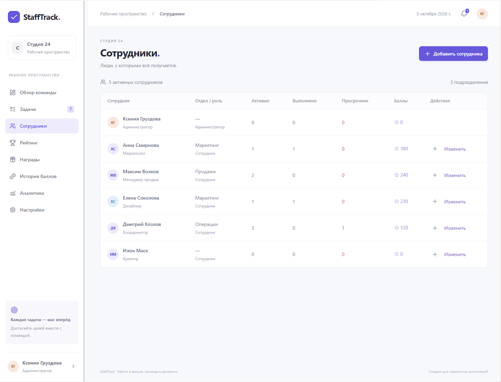
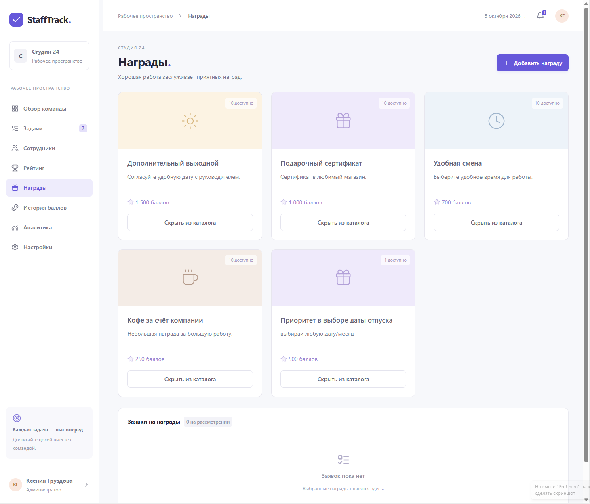
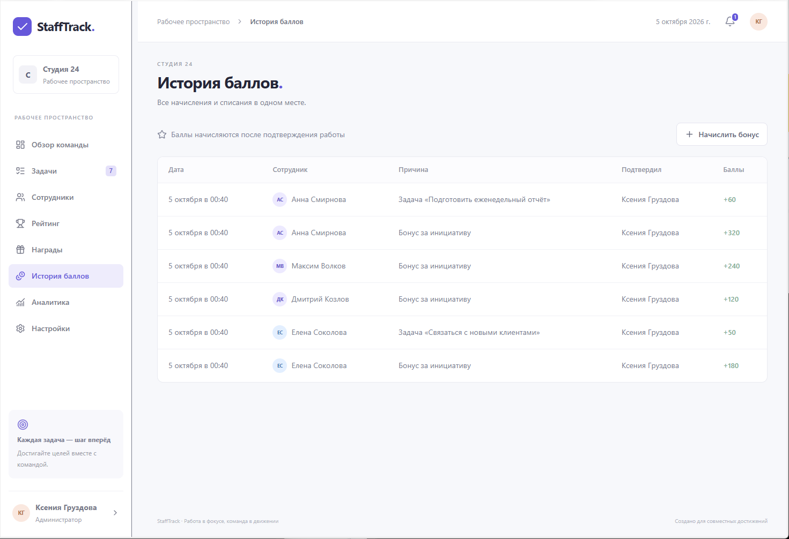
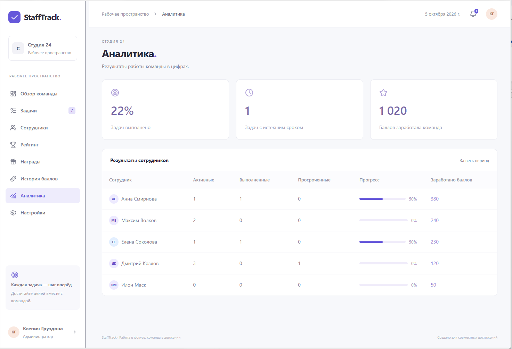
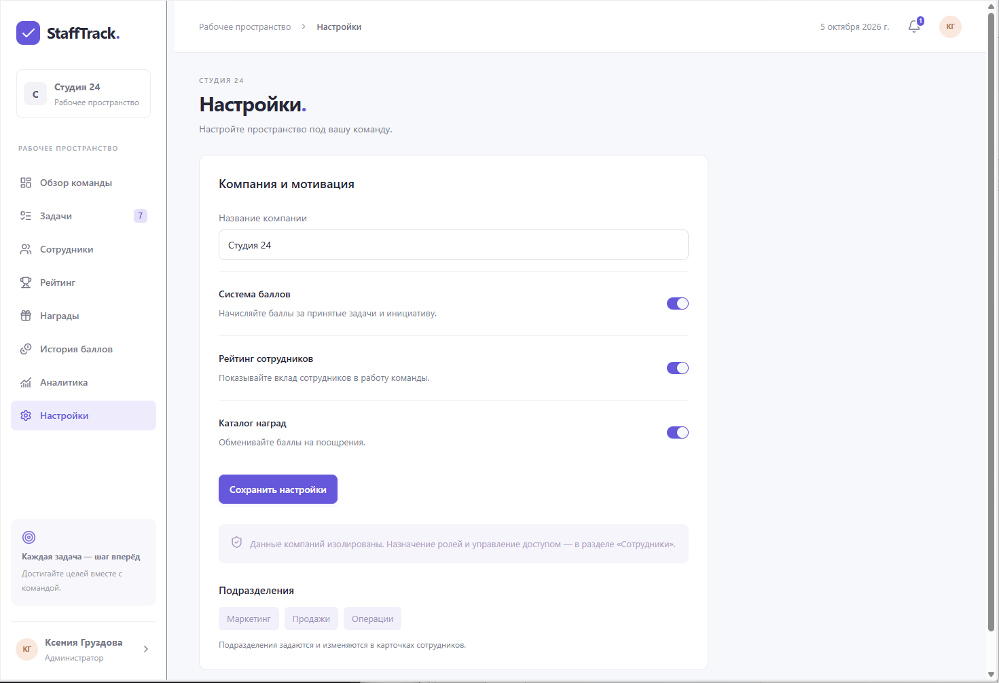

# StaffTrack

Трекер задач и мотивации сотрудников. Руководитель распределяет работу и проверяет результат, сотрудники выполняют задачи и получают баллы, которые можно обменять на награды.

**Автономная версия:** [StaffTrack на GitHub Pages](https://kgruzdova.github.io/stafftrack/). При первом открытии нажмите «Создать компанию» и задайте свой пароль. Данные сохраняются только в этом браузере, остаются после перезагрузки и удаляются при очистке данных сайта. Данные серверной версии не переносятся. [Описание и публикация](docs/GITHUB-PAGES.md).

**Серверная версия с общей базой:** [StaffTrack в Sites](https://stafftrack-team-pulse.ksugrukz.chatgpt.site/). Доступ зависит от настроек аудитории в Sites.

## Роли

- **Администратор** управляет сотрудниками, доступом и настройками компании; также работает с задачами и наградами.
- **Руководитель** создаёт задачи, проверяет работу, начисляет бонусы и рассматривает заявки на награды.
- **Сотрудник** видит свои задачи, отправляет результат на проверку, следит за баллами и выбирает награды.

Ниже описаны девять экранов по изображениям из папки `screenshots`. На скриншотах показан интерфейс администратора; доступные действия зависят от роли.

## 1. Вход

Вход в рабочее пространство по email и паролю. Ссылки под формой позволяют создать компанию или запросить восстановление доступа. Первый пользователь новой компании становится администратором. Для восстановления пароля по email необходимо подключить почтовый сервис; без него пароль меняет администратор.



## 2. Обзор команды

Главный экран руководителя показывает общее число задач, работу в процессе, выполненные задачи и просрочки. Блок прогресса отражает результаты текущего месяца. Таблица «Задачи в фокусе» позволяет открыть карточку задачи. Справа находятся задачи, ожидающие проверки, лидеры рейтинга и переход к наградам. В верхней панели доступны уведомления и профиль.



## 3. Задачи

Рабочий список задач с названием, исполнителем, статусом, сроком и баллами. Вкладки выделяют активные задачи, задачи на проверке, выполненные и просроченные. Поиск и фильтры помогают найти задачи по сотруднику, статусу, приоритету, подразделению и сроку. Представление переключается между списком и доской.

Кнопка «Создать задачу» доступна руководителю и администратору. Нажатие на строку открывает подробную карточку с описанием, комментариями, вложениями и историей действий. Рабочий цикл: **Новая → В работе → На проверке → Выполнена**. Руководитель может вернуть результат на доработку с указанием причины. Баллы начисляются после принятия работы.

В текущей версии кнопка «Редактировать задачу» в карточке позволяет изменить название, описание, срок, приоритет, баллы и состав исполнителей. Можно выбрать несколько сотрудников. У задачи общий статус: любой исполнитель может начать работу и отправить общий результат на проверку. После первого принятия указанное количество баллов получает каждый исполнитель. Редактирование доступно и для выполненных задач. Ссылки «Изменить приоритет» и «Изменить исполнителей» находятся прямо в карточке. При изменении состава исполнителей выполненная задача автоматически возвращается в работу; ранее начисленные баллы сохраняются. Скриншот ниже показывает исходное представление списка.

**Смена статуса:** руководитель и администратор выбирают «Новая», «В работе», «На проверке» или «Выполнена» в блоке «Статус задачи», нажимают «Применить» и подтверждают изменение. Статус «Выполнена» означает принятие работы и первое начисление баллов. При возврате в работу уже начисленные баллы сохраняются; повторное принятие не начисляет их второй раз тому же сотруднику. «Просрочена» определяется автоматически по сроку.

**Удаление:** руководитель и администратор нажимают «Удалить задачу» в карточке и подтверждают действие. Задача исчезает из списка, доски и отчётов; карточка и её вложения становятся недоступны. Уже начисленные баллы и история начислений сохраняются. Сотрудник не может удалять задачи или самостоятельно принимать работу.



## 4. Сотрудники

Список команды с должностями, подразделениями, ролями, количеством активных, выполненных и просроченных задач, а также балансом баллов. Нажатие на имя открывает профиль сотрудника и его историю. Администратор добавляет и редактирует пользователей, меняет роли и блокирует доступ. Руководитель может начислить бонус, указав причину.



## 5. Рейтинг сотрудников

Рейтинг показывает вклад сотрудников за неделю, месяц или всё время. Первые три места выделены отдельно; в таблице отображаются подразделение, число выполненных задач и заработанные баллы. Расходование баллов на награды не уменьшает рейтинг: он рассчитывается по положительным начислениям за выбранный период.


## 6. Каталог наград

Карточки наград содержат описание, стоимость в баллах и доступное количество. Сотрудник отправляет заявку на выбранную награду. Пока заявка рассматривается, баллы резервируются; списание происходит после подтверждения руководителем. Руководитель добавляет награды и скрывает их из каталога. В нижней части экрана находятся заявки и их статусы.



## 7. История баллов

Журнал начислений и списаний с датой, сотрудником, причиной, подтвердившим руководителем и суммой. Положительные значения обозначают принятые задачи и бонусы, отрицательные — выданные награды. Сотрудник видит свою историю, руководитель — историю компании. Кнопка «Начислить бонус» открывает форму разового поощрения.



## 8. Аналитика

Экран руководителя с долей выполненных задач, количеством просрочек и общим числом заработанных командой баллов. Таблица результатов сотрудников показывает активные, выполненные и просроченные задачи, процент выполнения и заработанные баллы за весь период.



## 9. Настройки компании

Администратор меняет название компании и включает или отключает систему баллов, рейтинг и каталог наград. Изменения применяются кнопкой «Сохранить настройки». Ниже отображаются подразделения команды; их названия задаются в карточках сотрудников. Данные разных компаний изолированы.



## Запуск локально

Исходники приложения находятся в корне этого репозитория. Требуется Node.js 22.13 или новее.

```powershell
git clone https://github.com/kgruzdova/stafftrack.git
cd stafftrack
powershell -ExecutionPolicy Bypass -File .\start.ps1
```

Откройте адрес, который напечатает сервер. Для первой работы нажмите «Создать компанию»; при регистрации можно добавить демонстрационную команду. Универсального пароля для опубликованного сайта нет: пользователи входят с паролями, заданными при регистрации или администратором.

Технические сведения об API, хранении данных, проверках и восстановлении пароля — в [документации приложения](docs/DEVELOPMENT.md).

## Публикация через GitHub

Исходники и автоматическая сборка: [репозиторий StaffTrack](https://github.com/kgruzdova/stafftrack). Публикация настроена через GitHub Actions в Cloudflare Workers с постоянной базой D1 и хранилищем R2. Для запуска нужны аккаунт Cloudflare и два секрета в настройках репозитория; пошаговая инструкция — [DEPLOYMENT.md](docs/DEPLOYMENT.md).

Сам GitHub Pages не запускает серверный API приложения. Без подключения Cloudflare workflow проверяет и собирает проект, но рабочий сайт на новом адресе не публикует.
